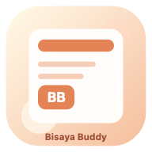

<p align="center">
  
</p>

<h1 align="center">Bisaya Buddy</h1>

<p align="center">
  Offline-first Bisaya learning app with guided lessons, pronunciation audio,
  quizzes, and native macOS/iOS wrappers.
</p>

<p align="center">
  
  
  
  
  
</p>

## Overview

Bisaya Buddy keeps the lesson content in one shared codebase and ships it across
three experiences:

- a browser version for fast iteration and easy sharing
- a native macOS wrapper built with SwiftUI and WebKit
- a native iPhone flow with a welcome screen, one lesson at a time, and lesson
  unlock progression

## Features

- 20 guided lesson blocks with vocabulary, phrases, and translations
- pronunciation helpers with bundled audio clips
- mini quizzes and typing practice
- single-file HTML export for offline sharing
- responsive web app structure with installable PWA behavior
- native Apple platform wrappers powered by the same lesson content

## Platforms

| Experience | Stack | Notes |
| --- | --- | --- |
| Web app | HTML, CSS, JavaScript | Best for fast local iteration and static hosting |
| macOS app | SwiftUI + WKWebView | Packages the bundled HTML into a desktop `.app` |
| iOS app | SwiftUI + WKWebView | App-style lesson progression for iPhone |

## Screenshots

This README is ready for screenshots, but no real captures are committed yet.
Good images to add later in `docs/images/` would be:

- the iPhone welcome screen
- the active lesson screen on iPhone
- the lesson completion popup
- the macOS wrapper window

## Getting Started

### 1. Run the web app locally

```bash
python3 -m http.server 4173
```

Then open [http://localhost:4173](http://localhost:4173).

You can also double-click `index.html` for a basic offline preview, but service
worker behavior and install prompts work best on `localhost` or `https`.

### 2. Build the single-file offline export

```bash
node build_single_file.js
```

This generates:

```text
Bisaya Buddy Single File.html
```

### 3. Run the macOS wrapper

```bash
./script/build_and_run.sh
```

The generated app bundle is placed in:

```text
dist/Bisaya Buddy.app
```

### 4. Run the iOS app

Open `BisayaBuddyIOS.xcodeproj` in Xcode, choose the `BisayaBuddyIOS` scheme,
then run it on a simulator or your iPhone.

Terminal build:

```bash
./script/build_ios_sim.sh
```

Simulator-targeted build:

```bash
./script/build_ios_sim.sh sim
```

If `node` is not available during the iOS build, the project falls back to the
already-generated `Bisaya Buddy Single File.html` in the repository root.

## Requirements

- `Node.js` for rebuilding the single-file HTML bundle
- `Python 3` for a quick local web server
- `Swift 6` / Xcode toolchain for the macOS app
- `Xcode 26.4` or newer for the iOS app
- `macOS 14` or newer for the macOS wrapper
- `iOS 26` or newer for the current iPhone target

## Documentation

- [Development Guide](docs/development.md)
- [iPhone Installation Guide](docs/ios-installation.md)
- [Project Architecture](docs/project-architecture.md)

## Project Structure

```text
.
├── index.html                    # Main web app markup
├── styles.css                    # Shared styling, including iOS-specific UI
├── app.js                        # Lesson flow, progress, quiz, and iOS shell logic
├── lesson-data.js                # Lesson catalog and entries
├── assets/                       # Icons and static assets
├── audio/                        # Generated pronunciation clips
├── build_single_file.js          # Bundles the web app into one self-contained HTML file
├── script/
│   ├── build_and_run.sh          # Builds and launches the macOS app
│   └── build_ios_sim.sh          # Builds the iOS project from Terminal
├── Sources/BisayaBuddyMacApp/    # Native macOS SwiftUI/WebKit wrapper
├── iOS/BisayaBuddyIOS/           # Native iOS app resources and entrypoint
└── BisayaBuddyIOS.xcodeproj/     # Xcode project for the iOS app
```

## Asset Generation

Rebuild pronunciation audio:

```bash
./generate_audio.sh
```

Regenerate app icons:

```bash
swift generate_icons.swift
```

## Notes

- The bundled audio clips are generated pronunciation helpers.
- The browser version, macOS app, and iOS app all use the same lesson content.
- The iOS experience intentionally presents one lesson at a time with a more
  app-like progression flow.
